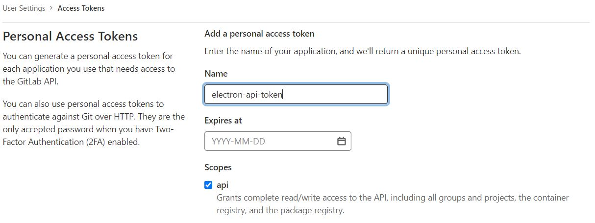
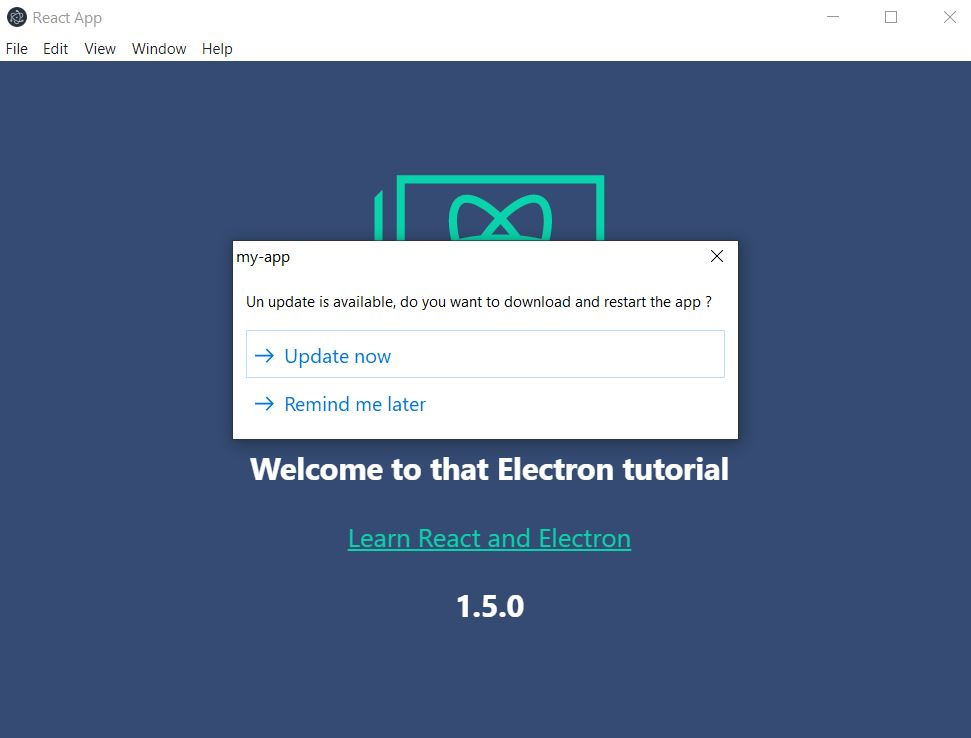

<div align="center">


</div>

# Electron & React : Build autoUpdate feature on Gitlab private repository

This project shows how to deploy auto-update feature on electron project hosted on Gitlab. Electron's auto-updater module allow downloading new versions automatically. 

## 1. Generate Gitlab token

<div align="center">


</div>

Create your own token with API scope.

## 2. Change ```package.json``` and ```main.ts``` with your own settings 
##### package.json :
```JSON
"repository": {
  "type": "git",
  "url": "https://gitlab.com/your-gitlab-username/your-repository-name/"
}
```
```JSON
"publish": {
"provider": "generic",
"url": "https://gitlab.com/api/v4/projects/Your-project-id/jobs/artifacts/your-branch-name/raw/dist?job=build"
}
```

##### electron/main.ts
```Javascript
// Auto update feature
autoUpdater.requestHeaders = {"PRIVATE-TOKEN": "your-gitlab-token"};
```

## 3. Build app and launch it locally

Run ```yarn run electron:dev``` to build your app. Run ```mercure.exe``` with command line or by double-clicking it.
You can see there is no new version available

## 4. Change files and push to repository

If you want to commit and publish a new version on your repository, don't forget to change the package.json version. Otherwise the auto-updater module won't be able to detect a new version

##### package.json :
```
"version": "1.5.0"
```

The commit will trigger gitlab pipeline :
```
Uploading artifacts for successful job
Uploading artifacts...
dist/: found 421 matching files and directories    
Uploading artifacts as "archive" to coordinator... ok 
Cleaning up file based variables
Job succeeded
```

Once the pipeline is finished, a new version is available at https://gitlab.com/your-username/your-repo-name/-/jobs/job-ID/artifacts/file
The ```latest.yml``` file is very important because it contains the version id.

## 5. Run your app

You should see this message : 

<div align="center">


</div>


